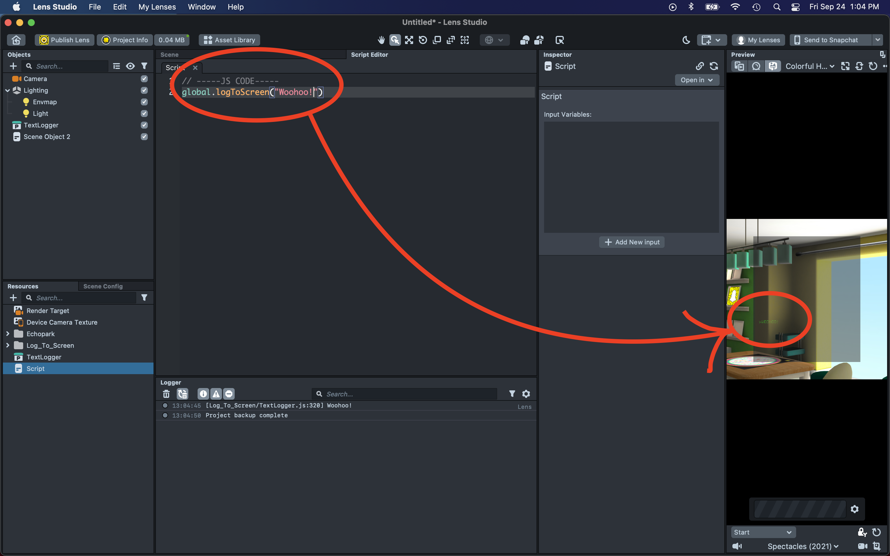

# Spectacles Logger

Anyone learning to code needs a way to read logs. But on Snap's Spectacles (2021), that's not an option out of the box. Furthermore, the [resource to support logging](https://lensstudio.snapchat.com/guides/scripting/debugging/) does not immediately work.

The problem with Snap's official logger is that the field of view is incorrect and the depth is not set an appropriate distance. The prefab in this repository, `TextLogger.oprfb`, should be a drag and drop solution 😉

## Using the prefab

1. Open or create a new project in Lens Studio.
2. Drag the `TextLogger.oprfb` file to the Resources section of Lens Studio.

3. Drag the prefab from Resources to the Objects in the scene.

4. In any script (except `Log_To_Screen/TextLoggerInput.js`), call `global.logToScreen("Woohoo!")` to print to the screen. Switch the simulator to the Spectacles to see what it will look like in each eye.

## License

Feel free to use this in any way, without attribution to me, within the (unspecified) licensing requirements of [the official code this is based on](https://lensstudio.snapchat.com/guides/scripting/debugging/).
